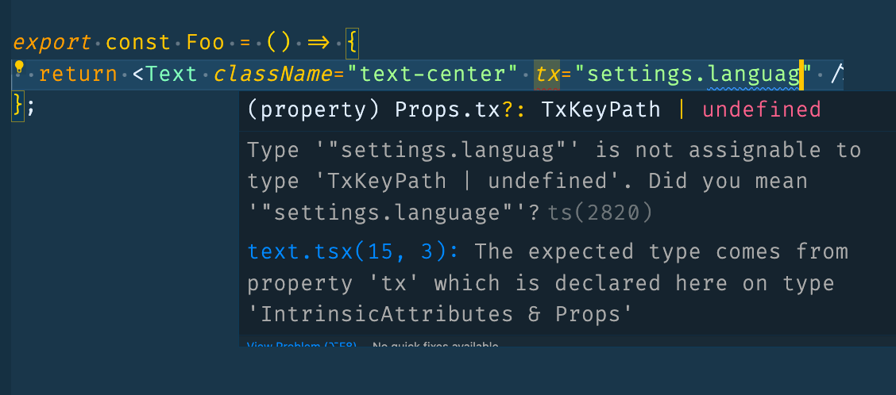

import CodeBlock from '@theme/CodeBlock';
import Resources from '!!raw-loader!../../../src/core/i18n/resources.ts';
import UseSetLanguage from '!!raw-loader!../../../src/core/i18n/utils.tsx';

# Internationalization

The starter comes with a basic internationalization setup. It uses [expo-localization](https://docs.expo.dev/guides/localization/) and [i18next](https://www.i18next.com/) to provide a simple way to translate your app.

## Adding a new language

Mainly the demo app support two languages: English and Arabic (RTL). You can add more languages by adding the translation files in the `src/translations` folder and adding the language code to the `src/core/i18n/resources.ts` file.

<CodeBlock title="src/core/i18n/resources.ts" language="tsx">
  {Resources}
</CodeBlock>

:::tip
Anything related to the internationalization should be found in the `src/core/i18n` folder.
:::

## Using translations in your app

The i18n core module provides a set utility functions to help you use translation in your app.

- `useTranslation` hook from `react-i18next`: to get the translation function.

```tsx
import React from 'react';
import { useTranslation } from 'react-i18next';

import { Text } from '@/ui';

export const Foo = () => {
  const { t } = useTranslation();
  return (
    <>
      <Text className="text-center">{t('settings.language')}</Text>
    </>
  );
};
```

or as Text component comes with translation support, you can easily use it as follows:

```tsx
import React from 'react';

import { Text } from '@/ui';

export const Foo = () => {
  return <Text className="text-center" tx="settings.language" />;
};
```

- `useSetLanguage` hook: to change the current language. this hook return the selected language and a function to change the language.

Additionally, the `useSetLanguage` hook will save the selected language in device storage using `MMKV` and will be used as the default language when the app is opened again As well as adding some extra config for RTL languages while updating the selected language.

<CodeBlock title="src/core/i18n/utils.tsx" language="tsx">
  {UseSetLanguage}
</CodeBlock>

## Robust translation

**Typescript support**

To make the translation for your app more robust and easy to maintain. we added typescript support for the translation function to make sure you are using the correct translation key.
here is an example of the error you will get if you are using a wrong translation key:



**Eslint rules**

We also added some eslint rules to make sure you are using you translation files resources are always up to date and the rules will run as a pre-commit hook when ever you are trying to commit changes to the translation files.
We use [eslint-plugin-i18n-json](https://github.com/godaddy/eslint-plugin-i18n-json) with a custom validation script for i18next to sort keys and make sure sure that all resource files are identical to prevent missing translations.
