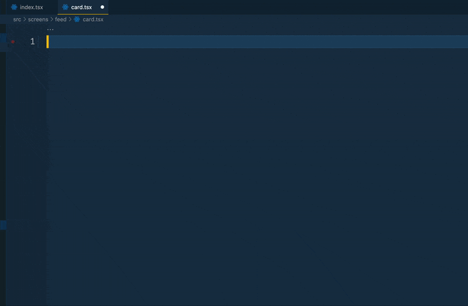

import CodeBlock from '@theme/CodeBlock';
import Card from '!!raw-loader!../../../src/screens/feed/card';
import View from '!!raw-loader!../../../src/ui/core/view';
import TouchableOpacity from '!!raw-loader!../../../src/ui/core/touchable-opacity';
import Pressable from '!!raw-loader!../../../src/ui/core/pressable';
import ScrollView from '!!raw-loader!../../../src/ui/core/scroll-view';
import ActivityIndicator from '!!raw-loader!../../../src/ui/core/activity-indicator';
import List from '!!raw-loader!../../../src/ui/core/list';
import EmptyList from '!!raw-loader!../../../src/ui/core/list/empty-list';
import Image from '!!raw-loader!../../../src/ui/core/image';
import Text from '!!raw-loader!../../../src/ui/core/text';
import Button from '!!raw-loader!../../../src/ui/core/button';
import Input from '!!raw-loader!../../../src/ui/core/input/input';
import Select from '!!raw-loader!../../../src/ui/core/select/select';

# Components

The starter comes with a set of basic components and a simple design system based on Nativewind to help you get started and save you time.

All those components can be found in the `src/ui/core` folder. Most of them are just wrappers around the React Native core components with `styled` function from Nativewind to make them ready for Tailwind CSS class Names.

Our philosophy is to keep the components as simple as possible and to avoid adding too much logic to them. This way, they are easier to reuse and to customize.

Based on your needs, you can either use them as they are or customize them to fit your needs as well as creating new ones based on the same approach.

```bash title="./src/ui/core"
.
├── activity-indicator.tsx
├── bottom-sheet
│   ├── backdrop.tsx
│   └── index.tsx
├── button.tsx
├── image.tsx
├── index.tsx
├── input
│   ├── controlled-input.tsx
│   ├── index.tsx
│   └── input.tsx
├── list
│   ├── empty-list.tsx
│   └── index.tsx
├── pressable.tsx
├── scroll-view.tsx
├── select-input
│   ├── arrow.tsx
│   ├── check.tsx
│   ├── index.tsx
│   ├── options.tsx
│   └── select-input.tsx
├── text.tsx
├── touchable-opacity.tsx
└── view.tsx
```

Here is a simple example of more project specific component that uses some primitives components from the `ui` folder.

<CodeBlock language="tsx" title="./src/ui/screen/feed/card.tsx">
  {Card}
</CodeBlock>

:::tip
To save time creating new component or screens, we can just start typing `comp` and click enter to create a new component with the right structure.


:::

## View

The `View` component is a wrapper around the React Native `View` component with the `styled` function from Nativewind to accept Tailwind CSS class names.

<CodeBlock language="tsx" title="./src/ui/core/view.tsx">
  {View}
</CodeBlock>

**Props**

- All React Native View Props are supported
- `className` - Tailwind CSS class names

**Use Case**

```tsx
import * as React from 'react';
import { View, Text } from '@/ui';

const MyComponent = () => {
  return (
    <View className="flex flex-col items-center justify-center">
      <Text>My Component</Text>
    </View>
  );
};
```

:::tip
You can use `v` snippet to create a simple View with a default classname
:::

## Touchable Opacity and Pressable

The `TouchableOpacity` and `Pressable` components are wrappers around the React Native `TouchableOpacity` and `Pressable` components with the `styled` function from Nativewind to accept Tailwind CSS class names.

<CodeBlock language="tsx" title="./src/ui/core/touchable-opacity.tsx">
  {TouchableOpacity}
</CodeBlock>

<CodeBlock language="tsx" title="./src/ui/core/pressable.tsx">
  {Pressable}
</CodeBlock>

**Props**

- All React Native TouchableOpacity and Pressable Props are supported
- `className` - Tailwind CSS class names

**Use Case**

```tsx
import * as React from 'react';
import { TouchableOpacity, Text } from '@/ui';

const MyComponent = () => {
  return (
    <TouchableOpacity
      className="flex flex-col items-center justify-center bg-gray-100"
      onPress={() => console.log('pressed')}
    >
      <Text>My Component</Text>
    </TouchableOpacity>
  );
};
```

## Scroll View

The `ScrollView` component is a wrapper around the React Native `ScrollView` component with the `styled` function from Nativewind to accept Tailwind CSS class names as `contentContainerStyle`.

<CodeBlock language="tsx" title="./src/ui/core/scroll-view.tsx">
  {ScrollView}
</CodeBlock>

**Props**

- All React Native ScrollView Props are supported
- `className` - Tailwind CSS class names that will be applied to the `contentContainerStyle`

**Use Case**

```tsx
import * as React from 'react';
import { ScrollView, Text } from '@/ui';

const MyComponent = () => {
  return (
    <ScrollView className="p-2">
      <Text>My Component1</Text>
      <Text>My Component2</Text>
    </ScrollView>
  );
};
```

## Activity Indicator

The `ActivityIndicator` component is a wrapper around the React Native `ActivityIndicator` component with the `styled` function from Nativewind to accept Tailwind CSS class names.

<CodeBlock language="tsx" title="./src/ui/core/activity-indicator.tsx">
  {ActivityIndicator}
</CodeBlock>

**Props**

- All React Native ActivityIndicator Props are supported
- `className` - Tailwind CSS class names

**Use Case**

```tsx
import * as React from 'react';
import { ActivityIndicator } from '@/ui';

const MyComponent = () => {
  return <ActivityIndicator className="text-blue-500" />;
};
```

## List

The `List` component is a wrapper around the `@shopify/flash-list` component with the `styled` function from Nativewind to accept Tailwind CSS class names as `contentContainerStyle`.

<CodeBlock language="tsx" title="./src/ui/core/list/index.tsx">
  {List}
</CodeBlock>

**Props**

- All `@shopify/flash-list` Props are supported
- `className` - Tailwind CSS class names that will be applied to the `contentContainerStyle`

<details>
  <summary>EmptyList</summary>
  <div>
    We also provide a `EmptyList` component that you can use to display a
    message when the list is empty. Feel free to customize it to fit your needs.
  </div>
  <CodeBlock language="tsx" title="./src/ui/core/list/empty-list.tsx">
    {EmptyList}
  </CodeBlock>
</details>

**Use Case**

```tsx
import * as React from 'react';
import { List, EmptyList, Text } from '@/ui';

const MyComponent = () => {
  return (
    <List
      data={['Item 1', 'Item 2']}
      renderItem={({ item }) => <Text>{item}</Text>}
      ListEmptyComponent={<EmptyList message="No items" />}
    />
  );
};
```

## Image

For the `Image` component, we use the `expo-image` library to provide a fast and performant image component. The `Image` component is a wrapper around the `Image` component from `expo-image` package with the `styled` function from Nativewind to accept Tailwind CSS className.

<CodeBlock language="tsx" title="./src/ui/core/image.tsx">
  {Image}
</CodeBlock>

**Props**

- All `expo-image` Props are supported
- `className` - Tailwind CSS class names

**Use Case**

```tsx
import * as React from 'react';
import { Image } from '@/ui';

const MyComponent = () => {
  return (
    <Image
      className="w-32 h-32"
      source={{
        uri: 'https://images.unsplash.com/photo-1524758631624-e2822e304c36',
      }}
    />
  );
};
```

## Text

The `Text` component comes with a set for variants based on a simple object configuration that you can easily customize.
With this custom Text component you can use translation key as `tx` prop and it will automatically translate the text based on the current locale as week as supporting rtl language based on selected locale.

<CodeBlock language="tsx" title="./src/ui/core/text.tsx">
  {Text}
</CodeBlock>

Make sure to update the `textVariants` object in `./src/ui/core/text.tsx` to fit your needs.

:::tip
You can also use the `t` snippet to create a simple Text with a default `className`.

If you want more complex variants logic, we recommend using [`cva` package ](https://github.com/joe-bell/cva)
:::

**Props**

- All React Native Text Props are supported
- `className` - Tailwind CSS class names
- `tx` - Translation key
- `variant` - Text variant, one of `textVariants` objects keys (default: `md`)

**Use Case**

```tsx
import * as React from 'react';
import { Text, View } from '@/ui';

const MyComponent = () => {
  return (
    <View className="flex flex-col items-center justify-center">
      <Text variant="h1" tx="welcome" />
      <Text variant="md" className="text-base">
        Hello world
      </Text>
    </View>
  );
};
```

## Button

The starter comes with simple `Button` component that you can use to create a simple `TouchableOpacity` with a `Text` component inside. The `Button` support multiple variants `primary`, `secondary` and `outline` based on a simple object configuration to making updating and adding new variants easy.

Every variant must contain style for `container`, `indicator` and `text` keys. The `container` style will be applied to the `TouchableOpacity` and the `text` style will be applied to the `Text` component and the `indicator` style will be applied to the `ActivityIndicator` component when the `loading` prop is `true`.

<CodeBlock language="tsx" title="./src/ui/core/button.tsx">
  {Button}
</CodeBlock>

**Props**

- All React Native TouchableOpacity Props are supported
- `variant` - Button variant, one of `buttonVariants` objects keys (default: `primary`)
- `loading` - Show loading indicator (default: `false`)
- `label` - Button label

**Use Case**

```tsx
import * as React from 'react';
import { Button, View } from '@/ui';

const MyComponent = () => {
  return (
    <View className="flex flex-col items-center justify-center">
      <Button
        variant="primary"
        label="Primary"
        onPress={() => console.log('Primary Button Pressed')}
      />
      <Button
        variant="secondary"
        label="Secondary"
        onPress={() => console.log('Secondary Button Pressed')}
      />
      <Button
        variant="outline"
        label="Outline"
        onPress={() => console.log('Outline Button Pressed')}
      />
    </View>
  );
};
```

## Input

We provide a simple `Input` component with a `Text` component for the label and a `TextInput` component for the input. This Input comes wit custom focus and error styling.

You can use it as the same way you use the `TextInput` component from React Native but with extra props to customize the label and error styling.

We tried to keep the `Input` component as simple as possible but you can add more functionality such as `onFocus` and `onBlur` or adding left and right icons to the input.

<CodeBlock language="tsx" title="./src/ui/core/input.tsx">
  {Input}
</CodeBlock>

**Props**

- All React Native TextInput Props are supported
- `label` - Input label
- `error` - Input error message

**Use Case**

```tsx
import * as React from 'react';
import { Input, View } from '@/ui';

const MyComponent = () => {
  return (
    <View className="flex flex-col items-center justify-center">
      <Input label="Email" error="Email is required" />
    </View>
  );
};
```

## Controlled Input

We provide a simple `ControlledInput` component that use the `Input` component under the hood but with a `useController` hook from `react-hook-form` to make it ready to use with `react-hook-form` library.

Read more about Handling Forms [here](./forms).

## Select

We provide a simple `SelectInput` component using a bottom sheet with a simple List component to select an item from a list of items.

We opt to use a bottom sheet instead of a dropdown to make it more flexible and easy to use on both iOS and Android and also to minimize the number of dependencies in the starter.

Feel free to update the component implementation to fit your need and as you keep the same Props signature for the `SelectInput` component the component will work with our form handling solution without any changes.

<CodeBlock language="tsx" title="./src/ui/core/select-input.tsx">
  {Select}
</CodeBlock>

**Props**

- `label`: `string` - Input label
- `error`: `string` - Input error message
- `options` : array of `{ label: string; value: string | number }` - List of items to select from
- `value` : `string | number` - Selected item value
- `onSelect`: `(option: Option) => void;` - Callback function to handle item selection
- `placeholder`: `string`- Placeholder text
- `disabled`: `boolean` - Disable select input (default: `false`)

**Use Case**

```tsx
import * as React from 'react';

import type { Option } from '@/ui';
import { SelectInput, View } from '@/ui';

const options: Option[] = [
  { value: 'chocolate', label: 'Chocolate' },
  { value: 'strawberry', label: 'Strawberry' },
  { value: 'vanilla', label: 'Vanilla' },
];

const MyComponent = () => {
  const [value, setValue] = React.useState<string | number | undefined>();
  return (
    <View className="flex flex-col items-center justify-center">
      <Select
        label="Select"
        error="Select is required"
        options={options}
        value={value}
        onSelect={(option) => setValue(option.value)}
      />
    </View>
  );
};
```

## Controlled Input

We provide a simple `ControlledSelect` component that use the `Select` component under the hood but with a `useController` hook from `react-hook-form` to make it ready to use with `react-hook-form` library.

Read more about Handling Forms [here](./forms).
